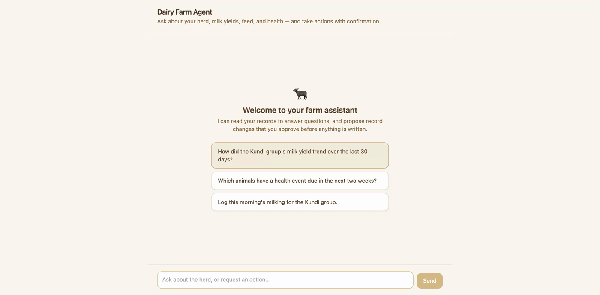
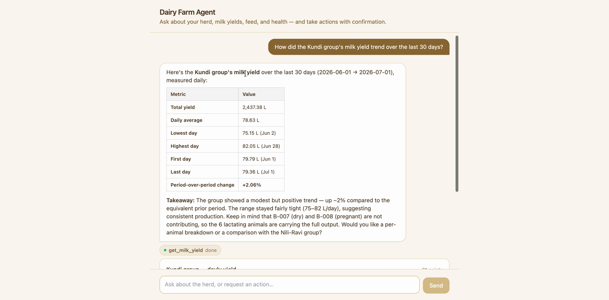
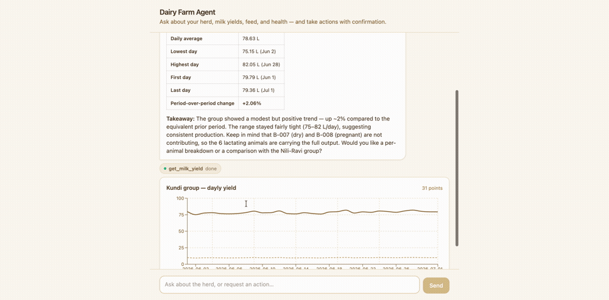

# Dairy Farm Management Agent

[](./LICENSE)

A working AI **agent** for managing a dairy farm's animals, milk yields, feed, and
health events. The agent answers questions about the farm **and takes real
actions** — but every state-changing action is gated behind an explicit human
confirmation.





It is built as an npm-workspaces monorepo with **two interchangeable frontends**
(React and Angular) that talk to the same, unmodified server over the identical
`POST /api/chat` contract:

```
dairy-agent/
  shared/       # TypeScript types shared by server + web (single source of truth)
  server/       # Express + Anthropic SDK orchestrator, SQLite, tools, agent loop
  web-react/    # React 18 + Vite + Tailwind + Recharts frontend
  web-angular/  # Angular 22 (standalone, zoneless) + Tailwind + ng2-charts frontend
```

Both frontends are feature-equivalent; pick either. The Angular port and its
architecture are documented in [docs/ANGULAR_PORT.md](docs/ANGULAR_PORT.md).

## Tech stack

- **Server:** Node, TypeScript, Express, official Anthropic SDK
  (`@anthropic-ai/sdk`), non-streaming.
- **Database:** SQLite via `better-sqlite3` (synchronous, zero-config).
- **Frontend (React):** React 18 + TypeScript + Vite, Tailwind CSS, Recharts.
- **Frontend (Angular):** Angular 22 standalone + zoneless, signals, Tailwind CSS,
  `ng2-charts` (Chart.js), `marked` + `DOMPurify` for markdown.
- **Model:** default `claude-sonnet-4-6` (override with `ANTHROPIC_MODEL`); falls
  back to the latest Sonnet if the configured model string is rejected.

> **Node version:** the React frontend runs on Node ≥ 20, but the **Angular 22**
> frontend requires Node `^22.22.3 || ^24.15.0 || >=26`. Use a satisfying version
> (e.g. via `nvm`) when working on `web-angular/`.

## Setup & run

```bash
# 1. install (compiles the better-sqlite3 native binding)
npm install

# 2. configure your key
cp .env.example .env        # then edit .env and add ANTHROPIC_API_KEY

# 3. create + seed the SQLite database (idempotent: drop + recreate)
npm run seed -w server      # creates server/dairy.db

# 4a. run server (:4000) + React web (:5173); Vite proxies /api -> :4000
npm run dev

# 4b. or run server (:4000) + Angular web (:4200); ng proxies /api -> :4000
npm run dev:angular
```

Then open <http://localhost:5173> (React) or <http://localhost:4200> (Angular).

`GET /api/health` returns `{ status: "ok", seeded: true, anthropicKey: <bool> }`
once the DB is seeded. If you start the server before seeding, the health check
and chat endpoint return a friendly "run `npm run seed` first" message instead
of failing obscurely.

### Useful scripts

- `npm run seed -w server` — recreate and seed `server/dairy.db` (fixed RNG, so
  the data — and the milk-yield trend — is reproducible).
- `npm run typecheck` — typecheck shared + server + web-react.
- `npm run build:angular` — build shared + the Angular frontend.
- `npm test -w server` — sanity tests for the digest shaper.
- `npm test -w web-angular` — Vitest unit tests for the Angular frontend.

## How this demonstrates assistant → agent

This demo is built to make four principles **observably true** in the running
app. Here is exactly where each one lives in the code:

### 1. The agent loop (interpret → execute → digest)

The model's native tool-calling drives everything — there is no hand-written
intent parsing. The loop in
[`server/src/agent/loop.ts`](server/src/agent/loop.ts) sends the conversation +
tool schemas to the model, runs whatever tools it calls, feeds results back, and
repeats until the model stops calling tools and writes the final answer. Tool
schemas live in [`server/src/tools/index.ts`](server/src/tools/index.ts) and the
system prompt (with a live farm catalog injected) in
[`server/src/agent/systemPrompt.ts`](server/src/agent/systemPrompt.ts).

### 2. Read/write split (writes are human-gated)

Read tools ([`server/src/tools/reads.ts`](server/src/tools/reads.ts)) execute
automatically inside the loop. Write tools
([`server/src/tools/writes.ts`](server/src/tools/writes.ts)) never run on their
own: when the model calls one, `runTurn` **pauses** and returns a
`PendingWrite` confirmation card (`done: false`). Nothing is written until the
user approves; the resume path executes only the approved writes and records a
"declined" tool result for the rest. Re-sending the same approval does not
double-write, because the server is stateless and only mutates on an explicit
approval decision in that request.

### 3. Display data is not reasoning data

`get_milk_yield` runs through the digest shaper in
[`server/src/tools/shaper.ts`](server/src/tools/shaper.ts). The **full time
series** (every bucket) is shipped to the client as a `Dataset` and rendered as
a chart — it **never enters the model's context**. The model receives only a
small **digest** (totals, mean, min/max, first/last, period-over-period %). You
can watch this in the server logs: `[loop] read get_milk_yield -> model digest:`
prints the stats, not the raw rows.

### 4. Wrong cheaply, never expensively

- **Bad args → structured errors the model can retry.** Read tools return
  `{ error: ... }` digests (e.g. `missing_scope`, `unknown_group`) instead of
  throwing.
- **Hallucinated IDs are blocked for free.** The ID-integrity guard
  (`guardIds` in [`server/src/tools/index.ts`](server/src/tools/index.ts)) checks
  every `animal_id`/`group` against the DB *before* any tool runs.
- **Oversized requests are capped deterministically.** The shaper coarsens
  `day → week` past 90 days and `→ month` past a year before doing any work, so a
  huge range can't blow up the dataset or the digest.
- **The loop is bounded.** `max_tokens` per call and a max-iteration cap (with a
  graceful "narrow it down" message) live in `loop.ts`.

## Scale design

The herd is ~14 animals, so the full catalog fits cheaply in the system prompt.
But `search_animals` is already implemented with a top-K bound (8) and a
`tooMany` flag, and `buildSystemPrompt` will omit the inline animal list and
steer the model to `search_animals` once the herd exceeds a threshold (300).
The seam is wired even though the demo never crosses it.

## Out of scope

No auth/multi-user, no deletes, no IoT/hardware, no cloud deploy. Single-operator
local demo backed by a local SQLite file.
