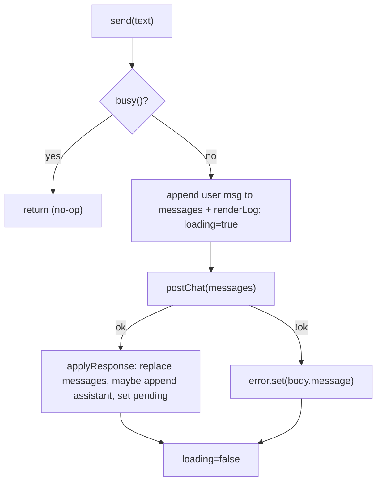

# Dairy Farm Agent - Angular Frontend (Port Internals)

A low-level reference for the **Angular 22** frontend (`web-angular/`), a feature-parity
port of the React frontend (`web-react/`). Both talk to the **same, unmodified** `server/`
over the identical `POST /api/chat` wire contract. For the backend agent loop, guardrails,
and tool contracts, see [TECHNICAL.md](./TECHNICAL.md); this document does not repeat them.

The port was done in tagged phases (`angular-port/00-scaffold` .. `angular-port/05-parity-qa`).
This document describes the resulting architecture, not the migration steps.

---

## Section 1 - State service (the core)

All UI renders off a single injectable, [web-angular/src/app/core/chat-store.ts](../web-angular/src/app/core/chat-store.ts).
It is a direct port of the state model in `web-react/src/App.tsx`: five state atoms, two
derived values, and the three imperative flows (`send`, `resolve`, `applyResponse`) around
one `fetch` call.

### 1.1 React -> Angular mapping

| React (`App.tsx`) | Angular (`ChatStore`) |
|---|---|
| `useState<AnthropicMessage[]>` `messages` | `signal<AnthropicMessage[]>` `messages` |
| `useState<TurnItem[]>` `renderLog` | `signal<TurnItem[]>` `renderLog` |
| `useState<PendingWrite[] \| null>` `pending` | `signal<PendingWrite[] \| null>` `pending` |
| `useState<boolean>` `loading` | `signal(false)` `loading` |
| `useState<string \| null>` `error` | `signal<string \| null>` `error` |
| `const busy = loading \|\| pending !== null` | `computed(() => loading() \|\| pending() !== null)` |
| `useMemo(() => renderLog.length === 0)` `isEmpty` | `computed(() => renderLog().length === 0)` |
| `useCallback` `send` / `resolve` / `applyResponse` | plain `async` methods |
| module-level `idSeq` + `nextId()` | instance `seq` + `nextId()` |

The behavior is preserved exactly:

- **`send(text)`** - no-ops if `busy()`; clears error; optimistically appends the user
  message to both `messages` and `renderLog`; posts the full `messages` array; applies the
  response.
- **`resolve(approvals)`** - clears `pending`; resends the **unchanged** `messages` plus the
  `approvals` array (client-authoritative full-history resend).
- **`applyResponse(resp)`** - replaces `messages` with the server's opaque history, appends an
  assistant `TurnItem` only when there is content (`assistantText || toolCalls.length ||
  datasets.length`), and sets `pending` from `render.pendingWrites ?? null`.
- **`postChat`** - `fetch('/api/chat', POST)`; on `!res.ok` it reads `body.message` for the
  error banner, exactly as the React `api.ts` did.

`TurnItem` is ported verbatim in
[web-angular/src/app/core/turn-item.type.ts](../web-angular/src/app/core/turn-item.type.ts).

### Diagram A - one send turn



---

## Section 2 - Component tree

Every component is **standalone**, `OnPush`, and uses signal-based `input()` / `output()`.
`ChatPanel` injects `ChatStore` directly instead of prop-drilling (the one structural
improvement over the React prop chain).

| React component | Angular component | Notes |
|---|---|---|
| `App.tsx` | [app.ts](../web-angular/src/app/app.ts) | thin shell, renders `<app-chat-panel>` in the `farm-50/farm-900` container |
| `ChatPanel.tsx` | [chat-panel.ts](../web-angular/src/app/components/chat-panel.ts) | injects `ChatStore`; scroll-to-bottom via `afterRenderEffect` |
| `MessageList.tsx` | [message-list.ts](../web-angular/src/app/components/message-list.ts) | `@for` over `renderLog()` |
| `Message.tsx` | [message.ts](../web-angular/src/app/components/message.ts) | user/assistant bubbles, chips, chart slots |
| `Composer.tsx` | [composer.ts](../web-angular/src/app/components/composer.ts) | local `signal('')`, Enter-to-send / Shift+Enter |
| `ConfirmationCard.tsx` | [confirmation-card.ts](../web-angular/src/app/components/confirmation-card.ts) | details `<dl>` + optional `rows` table; approve/reject |
| `EmptyState.tsx` | [empty-state.ts](../web-angular/src/app/components/empty-state.ts) | starters; `output('pick')` |
| `ToolCallChip.tsx` | [tool-call-chip.ts](../web-angular/src/app/components/tool-call-chip.ts) | local `open` signal toggle |
| `ChartCard.tsx` | [chart-card.ts](../web-angular/src/app/components/chart-card.ts) | Recharts -> Chart.js (`ng2-charts`) |
| (react-markdown pipeline) | [markdown-view.ts](../web-angular/src/app/components/markdown-view.ts) | `marked` + `DOMPurify` |

Tailwind classes are copied **verbatim** from the JSX; the `farm` palette and the
`.prose-chat` markdown CSS were ported into
[web-angular/tailwind.config.js](../web-angular/tailwind.config.js) and
[web-angular/src/styles.css](../web-angular/src/styles.css).

### 2.1 Scroll-to-bottom

React used `useRef` + `useEffect([renderLog, pending, loading])`. Angular uses
`viewChild<ElementRef>('scrollEl')` + `afterRenderEffect`, which re-runs after the DOM is
updated whenever the tracked signals change - so `scrollHeight` reflects the new content:

```ts
afterRenderEffect(() => {
  this.store.renderLog(); this.store.pending(); this.store.loading();
  const el = this.scrollEl()?.nativeElement;
  el?.scrollTo?.({ top: el.scrollHeight, behavior: 'smooth' });
});
```

---

## Section 3 - Deliberate decisions & omissions

### 3.1 No `resource()` / `rxResource()`

Intentionally not used. `send` / `resolve` are imperative "fire an action, react to its
result" flows, not reactive GET-style data fetching. `resource()` models a *derived read* of
some reactive request; forcing it here would misrepresent the interaction (each turn mutates
server-owned history and is triggered by an explicit user action). Reserved for a future
step if a genuinely reactive read emerges.

### 3.2 Markdown: `marked` + `DOMPurify`, not `ngx-markdown`

The React `Message` used `react-markdown` + `remark-gfm` + `DOMPurify` with an element
allowlist. The Angular equivalent
([markdown-view.ts](../web-angular/src/app/components/markdown-view.ts)) uses `marked`
(GFM tables on by default) piped through `DOMPurify` with an `ALLOWED_TAGS` list mirroring
that same allowlist, then bound via `[innerHTML]`.

`ngx-markdown` (the obvious wrapper) was **rejected**: its peer set includes `zone.js`
(this app is zoneless) plus `katex`/`mermaid`/`prismjs`/`emoji-toolkit` we don't need.
`marked` + `DOMPurify` gives exact allowlist parity with the React pipeline and no extra
weight.

### 3.3 Charts: `ng2-charts` (Chart.js), not Recharts

Recharts is React-only. `ng2-charts` reproduces the two-series line chart: `totalLitres`
(solid `#8a6431`), `avgPerAnimal` (dashed `#c29b5c`), `cubicInterpolationMode: 'monotone'`
(matching Recharts `type="monotone"`), `pointRadius: 0`, farm-colored axes/grid, and a
shared tooltip (`interaction: { mode: 'index' }`). Registered via
`provideCharts(withDefaultRegisterables())` in
[app.config.ts](../web-angular/src/app/app.config.ts).

### 3.4 Angular 22 idioms

- **Zoneless.** No `zone.js`; `provideZonelessChangeDetection()` is explicit in the app
  config. Change detection is driven entirely by signals.
- **Suffix-less naming.** Files follow the Angular 22 convention (`chat-panel.ts` /
  class `ChatPanel`), consistent with the CLI scaffold (`app.ts` / `App`), rather than the
  older `*.component.ts` suffix.
- **Testing on Vitest.** The v22 CLI scaffolds the `@angular/build:unit-test` (Vitest)
  builder; all specs use it. Chart rendering is excluded from unit tests (jsdom has no 2D
  canvas context) and verified visually instead.

---

## Section 4 - Build, run, and config quick reference

| Setting | Value | Location |
|---|---|---|
| Node.js | `^22.22.3 \|\| ^24.15.0 \|\| >=26` (Angular 22 requirement) | - |
| Angular | 22 (standalone, zoneless) | [web-angular/package.json](../web-angular/package.json) |
| Dev server port | `4200` (proxies `/api` -> `:4000`) | [web-angular/proxy.conf.json](../web-angular/proxy.conf.json) |
| Run server + Angular | `npm run dev:angular` | root [package.json](../package.json) |
| Run server + React | `npm run dev` | root [package.json](../package.json) |
| Build Angular | `npm run build:angular` (builds shared first) | root [package.json](../package.json) |
| Unit tests | `npm test -w web-angular` (Vitest) | - |
| Charts | `ng2-charts` + `chart.js` + `@angular/cdk` | [web-angular/package.json](../web-angular/package.json) |
| Markdown | `marked` + `dompurify` | [web-angular/package.json](../web-angular/package.json) |
| Shared types | `@dairy/shared` (built to `dist/` first) | [shared/](../shared) |

The wire contract, agent loop, and all guardrails are unchanged - see
[TECHNICAL.md](./TECHNICAL.md).
