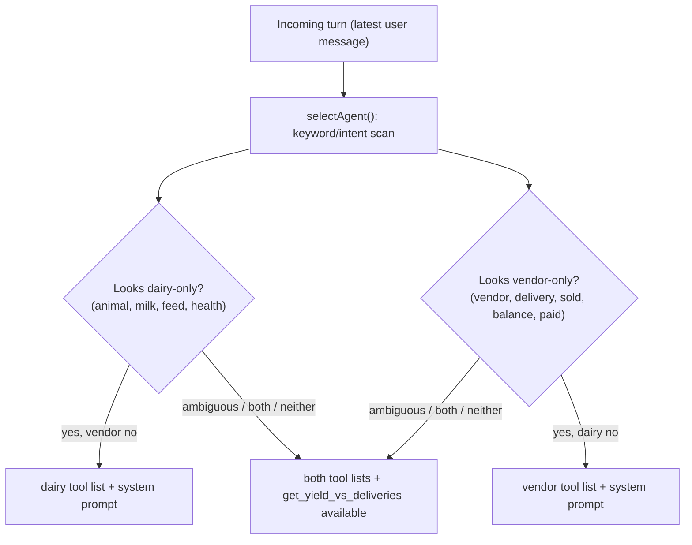

# Multi-Agent System — Decision Doc (Cycle 2)

*Status: in progress. Supersedes the Cycle 2 note in [OBSERVABILITY.md](OBSERVABILITY.md)
§ Open items ("no decision yet on eval/regression tooling — that's Cycle 2").
Regression testing has been resequenced to Cycle 3 — it now follows the
multi-agent system instead of preceding it, so it can be scoped against a shape
that has actually stabilized. Its own doc (`REGRESSION.md`) is authored when
Cycle 3 begins; the resequencing is noted inline here and in OBSERVABILITY.md.*

## Context

`dairy-agent` (Cycle 1, `v0.4.0`) covers one domain: herd, health, and milk
yield — single agent, single Angular/AG-UI transport, traced end-to-end via
self-hosted Langfuse. The real farm this models — Baghicha Dairy Co. — also
sells milk to vendors, and that side of the operation has no representation in
the app at all.

Cycle 2's goal: a second agent that owns the vendor/sales side, coexisting with
the dairy agent in the same running application, with one deliberate point of
contact between them — reconciling how much milk was produced against how much
was delivered. Target release tag: `v0.5.0`.

## What we're NOT doing

- **No auth or multi-user system.** Same single-operator model as the existing
  `## Out of scope` line in [PROJECT_OVERVIEW.md](PROJECT_OVERVIEW.md). The
  actual risk (an agent executing an irreversible sales-data write unsupervised)
  is already handled by the approval-gate pattern below, without touching auth.
- **No invoicing or payment processing in v1.** A vendor owes a running
  balance; whether it's been settled is a boolean flag, not a ledger.
- **No third "orchestrator" LLM persona.** Whatever decides which agent handles
  a turn is plumbing, not a system-prompted agent in its own right.
- **No cross-service network calls (A2A) for reconciliation.** See Decision 1 —
  this app is one Express process over one SQLite file, and reconciliation is a
  same-process query, not a network hop.

## Options considered

### Decision 1 — Process architecture

| Option | Fit |
|---|---|
| **Single process, single SQLite file, two tool-schema sets** | Matches the app exactly as it exists today — one `server/`, one `db.ts`, one `DB_PATH`. Reconciliation is a plain join across `milkings` and a new `deliveries` table, no network boundary. |
| **Two separate services + A2A protocol** | The "textbook" multi-agent shape and a better rehearsal of A2A — but it means service discovery, a second deployable, and a real network boundary for a farm with one operator and a handful of vendors. Solves a scaling problem this app doesn't have. |

**Decision: single process, single SQLite file.** The A2A rehearsal is a good
reason to want the second option *eventually*, as a later isolated exercise —
not a reason to pay distributed-systems overhead in Cycle 2.

### Decision 2 — What makes this "two agents" rather than "one agent, more tools"

[PROJECT_OVERVIEW.md](PROJECT_OVERVIEW.md) states the app's first design
principle: *the model's native tool-calling drives everything — there is no
hand-written intent parsing.* Taken literally, the simplest Cycle 2 is one
agent, one merged tool list (`ALL_TOOLS` + vendor tools).

That's the option to name honestly — it's the most consistent with the app's
stated philosophy. It's also not what was asked for: the goal is a **multi-agent
system**, and one agent with a longer tool list has no distinct persona, no
distinct scope of judgment, nothing to coordinate.

| Option | Fit |
|---|---|
| **A. One agent, merged tool list** | Simplest, most consistent with "no hand-written intent parsing." Doesn't produce a multi-agent system — just a bigger tool surface. |
| **B. Two agents (distinct system prompts, distinct tool lists), a thin dispatcher selects which set(s) apply** | Genuinely two agents with distinct scopes of judgment. The dispatcher is a small, explicit exception to "no hand-written intent parsing" — but it only *routes*, never decides what to *do*. |

**Decision: Option B.** The dispatcher selects which agent (`dairy`, `vendor`,
or `both`) sees the turn; it never inspects tool arguments, never decides what
action to take, and defaults to `both` whenever a query could span both domains
(the safe default — reconciliation questions live here).

## Data model

New tables, additive to the schema in [server/src/db.ts](../server/src/db.ts)
(same `TEXT PRIMARY KEY` / prefixed-id convention as `animals`, `milkings`):

```sql
CREATE TABLE vendors (
  id              TEXT PRIMARY KEY,
  name            TEXT NOT NULL,
  contact         TEXT,
  price_per_litre REAL NOT NULL,
  status          TEXT NOT NULL   -- 'active' | 'inactive'
);

CREATE TABLE deliveries (
  id              TEXT PRIMARY KEY,
  vendor_id       TEXT NOT NULL REFERENCES vendors(id),
  date            TEXT NOT NULL,
  litres          REAL NOT NULL,
  price_per_litre REAL NOT NULL,   -- captured at delivery time; vendor price may change later
  paid            INTEGER NOT NULL DEFAULT 0
);
CREATE INDEX idx_deliveries_date   ON deliveries(date);
CREATE INDEX idx_deliveries_vendor ON deliveries(vendor_id);
```

Matching domain types in [shared/src/types.ts](../shared/src/types.ts):

```ts
export type VendorStatus = 'active' | 'inactive';

export interface Vendor {
  id: string;
  name: string;
  contact: string | null;
  price_per_litre: number;
  status: VendorStatus;
}

export interface Delivery {
  id: string;
  vendor_id: string;
  date: string;
  litres: number;
  price_per_litre: number;
  paid: boolean;
}
```

`deliveries` and `milkings` are **not** linked by a foreign key — the two tables
belong to different agents' domains and are only ever joined read-only, by
`get_yield_vs_deliveries` (see Reconciliation), never written jointly. The ERD
in [PROJECT_OVERVIEW.md](PROJECT_OVERVIEW.md) § 8 is extended with both tables.

## Vendor-agent tool set

Same read/write split as the dairy tools, in new sibling files
(`server/src/tools/vendorReads.ts`, `vendorWrites.ts`) so the dairy tool files
stay untouched.

**Reads** (auto-execute, same `ReadToolResult` shape):
- `list_vendors` — mirrors `list_animals`.
- `get_vendor` — running balance (unpaid deliveries × price) + recent
  deliveries for one vendor; mirrors `get_animal`'s detail + summary shape.
- `get_deliveries` — date-range query for one vendor or all; mirrors
  `get_milk_yield`'s scope args (`vendor_id?`, `from`, `to`).

**Writes** (confirmation-gated, same `PendingWrite` card pattern):
- `register_vendor` — mirrors `add_animal`.
- `record_delivery` — one vendor + one quantity per call; captures
  `price_per_litre` from the vendor at call time so a later price change never
  rewrites history. Card mirrors `log_milking`.
- `mark_delivery_paid` — single-field update; mirrors `update_feed_inventory`.

`guardIds` in [server/src/tools/index.ts](../server/src/tools/index.ts) gets one
addition — a `vendor_id` existence check alongside the existing `animal_id` /
`group` checks — so a hallucinated vendor id is rejected before any tool runs,
exactly as it already is for animals.

## Reconciliation

The one read tool that makes this genuinely two agents and not two apps sharing
a repo:

- **`get_yield_vs_deliveries(from, to)`** — sums `milkings.yield_litres` and
  `deliveries.litres` over the range and returns both totals plus a
  `discrepancyLitres` figure and `flagged: boolean` (past a tolerance, e.g. 5%).
  Available only to the `both` selection, since it's the one tool that
  legitimately needs both tables.
- A real discrepancy means something: spoilage, home consumption not logged as a
  "sale," a measurement gap, or a genuine data-entry error. It's the
  load-bearing example, built early (Phase 02) rather than last, and verified
  against a deliberately-mismatched seed window.

## Dispatch — per turn

`selectAgent(latestUserText): 'dairy' | 'vendor' | 'both'` — a small, explicit
keyword/intent scan in `server/src/agent/dispatch.ts`. It only routes.



`both` is the default, not a fallback to special-case away — reconciliation
questions only make sense there, and an over-eager single-domain match is more
costly to get wrong than an unnecessary merged tool list.

**Cross-domain follow-ups.** The dispatcher routes on the latest message, but a
terse follow-up can depend on an earlier turn (e.g. after "how much did we
produce last week?", the user asks "does that match what we delivered?"). Judged
alone that second turn is vendor-only and would miss `get_yield_vs_deliveries`.
So `selectAgent` also takes the *previous* user message: when the latest turn is
single-domain, carries a comparison cue (`match`/`compare`/`vs`/`versus`/
`against`), and the previous turn was the *other* specific domain, it escalates
to `both`. Same-domain comparisons ("compare Kundi vs Nili-Ravi") and
keyword-less follow-ups (already `both`) are unaffected. This is the minimum
context needed to route cross-domain follow-ups; full conversational reference
resolution still relies on the model seeing the complete history.

**Note on the code (validated against the current codebase):** there is no
existing per-turn tool-list/system-prompt selection to "wire into" —
[stream.ts](../server/src/agent/stream.ts) builds one
`buildSystemPrompt(todayISO())` and passes the full `ALL_TOOLS` on every call.
So Cycle 2 *builds* that selection: `buildSystemPrompt` becomes agent-aware
(dairy prompt + catalog, vendor prompt + catalog, merged for `both`), a
`buildVendorCatalog()` is added mirroring the existing `buildCatalog()`, and
`stream.ts` calls `selectAgent()` once per run to choose the tool subset and
prompt.

## Approval gate & event naming

Vendor writes reuse the **exact** pause/resume mechanism already built for dairy
writes — `PendingWrite` card, human confirmation, stateless resume via
`forwardedProps.approvals`, signalled by a plain `RUN_FINISHED { success }` plus
a CUSTOM pending event (deliberately *not* an AG-UI interrupt outcome; see the
note in [stream.ts](../server/src/agent/stream.ts) and
[AGUI_MIGRATION.md](AGUI_MIGRATION.md)). No new mechanism.

One naming decision, in the spirit of the `ba258a4` doc-drift cleanup: the
existing custom AG-UI event names in [shared/src/types.ts](../shared/src/types.ts)
are dairy-specific — `DAIRY_DATASET_EVENT` (`'dairy.dataset'`),
`DAIRY_MESSAGES_EVENT` (`'dairy.messages'`), `DAIRY_PENDING_EVENT`
(`'dairy.pending'`). Once a vendor write can also pause a run, `dairy.pending`
is misleading.

**Decision:** generalize to `AGENT_DATASET_EVENT` / `AGENT_MESSAGES_EVENT` /
`AGENT_PENDING_EVENT` (`'agent.dataset'`, `'agent.messages'`, `'agent.pending'`),
updating `stream.ts` and the Angular event handler together in one phase so the
two never coexist.

## Frontend — single unified panel

**Decision: one chat, no router.** The dispatcher decides the agent per turn
server-side, so a single unified chat panel is more consistent than routing the
user to a "dairy" or "vendor" screen (which would fight the auto-dispatcher).
The Angular app has no `@angular/router` today and none is introduced.

The existing leaf components (`tool-call-chip.ts`, `confirmation-card.ts`,
`chart-card.ts`, `message`) are already generic — they render by AG-UI event
channel / data shape, not by tool name — so they are reused as-is. No
tool-name-to-renderer map is needed. The only store change is the event-name
rename above; the endpoint stays `/api/agent/run`.

One addition: **tag each rendered assistant turn with which agent (`dairy` /
`vendor` / `both`) handled it**, so the two-agent nature is visible in the
transcript, not just in the architecture. The chosen agent is emitted from the
server and rendered as a small tag on the assistant turn. The panel's static
title is updated to name the whole app rather than dairy-only copy.

## Implementation plan

Phased and tagged the same way as `angular-port/*` and `agui-migration/*`:

| Phase | Scope |
|---|---|
| `multi-agent/00-decisions` | This doc; resequencing note in OBSERVABILITY.md; ERD extended in PROJECT_OVERVIEW.md. |
| `multi-agent/01-vendor-schema-tools` | `vendors` / `deliveries` tables, db helpers, `Vendor`/`Delivery` types, seed data, `vendorReads.ts` / `vendorWrites.ts`, `guardIds` extension. |
| `multi-agent/02-reconciliation` | `get_yield_vs_deliveries`, verified against seeded data with a deliberately-mismatched case. |
| `multi-agent/03-dispatcher` | `selectAgent`, agent-aware `systemPrompt.ts`/`catalog.ts`, per-turn selection in `stream.ts`. |
| `multi-agent/04-approval-gate-generalize` | Vendor writes through the existing pause/resume path; `dairy.*` → `agent.*` event rename. |
| `multi-agent/05-frontend-shell` | Per-turn agent tag; panel title update. No router. |
| `multi-agent/06-parity-qa` | Live verification against the running app (Cycle 1 standard): a mixed conversation touching both agents plus one reconciliation query, checked against actual Langfuse traces. Tag `v0.5.0`. |

## Open items

- Revisit Decision A (merged tools vs. two agents) if the dispatcher's
  `both`-by-default behavior fires on nearly every turn — a sign the two domains
  overlap more than expected.
- Whether reconciliation needs its own small persistent UI widget or is fine as
  a normal chat answer — deferred, not urgent for v1.
- Confirm per-delivery `price_per_litre` capture holds once real data is entered
  (a later price change must never rewrite delivery history).
