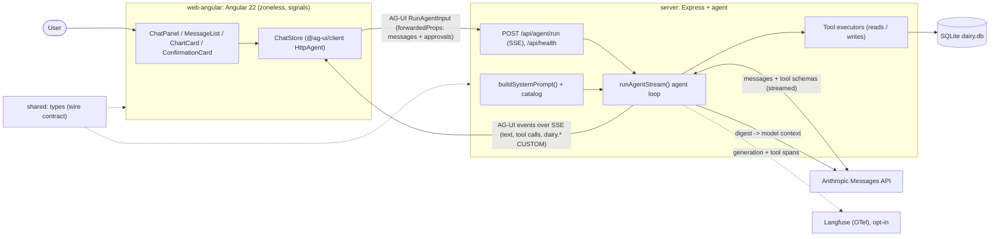
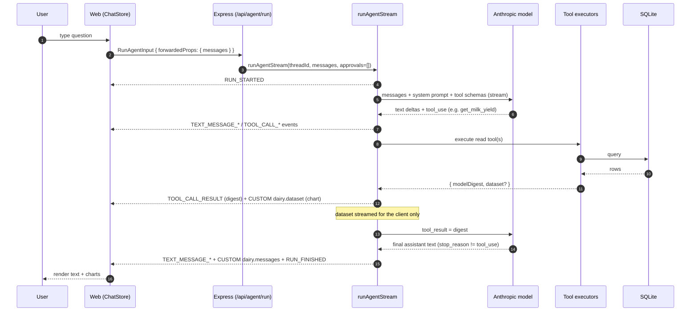
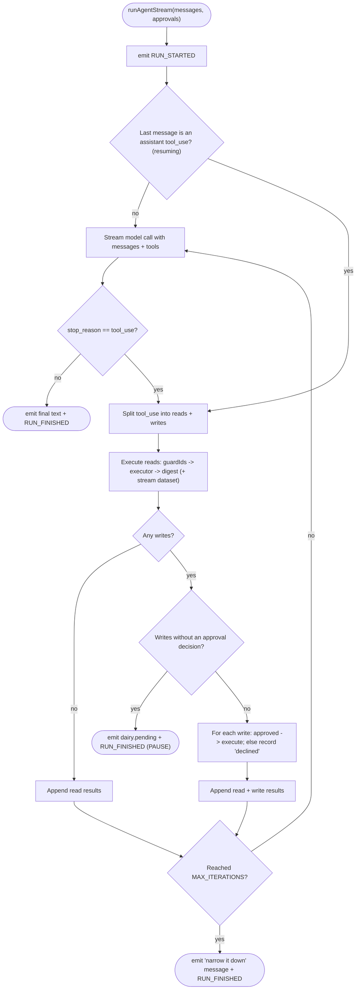
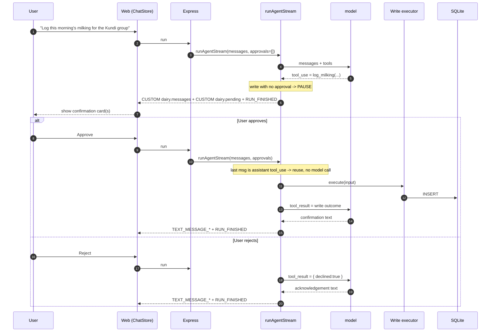
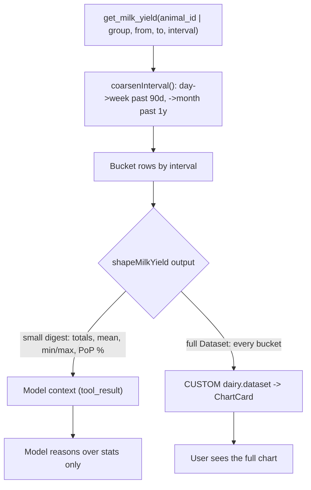
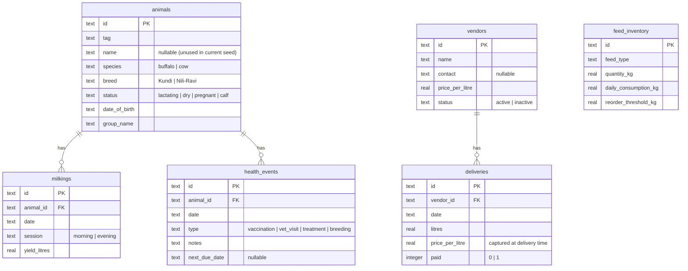
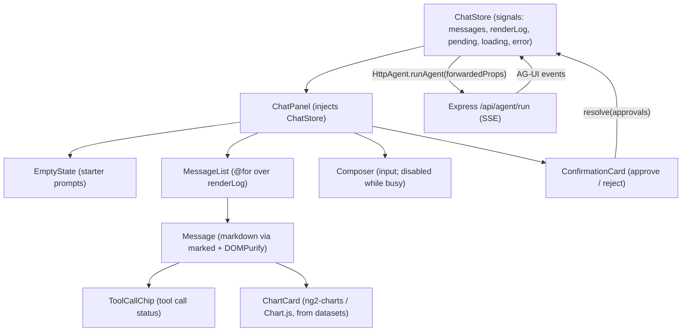

# Dairy Farm Agent - Project Overview

A working AI **agent** for managing a dairy farm's animals, milk yields, feed, and health events. It answers questions about the farm **and takes real actions** - but every state-changing action is gated behind an explicit human confirmation. This document explains how the system is put together, with a deliberate focus on the **agentic workflow**.

For setup and run instructions, see the [README.md](../README.md). This document is about *how it works*. The transport-layer design decisions (why AG-UI, how the interrupt/resume boundary works) live in [AGUI_MIGRATION.md](./AGUI_MIGRATION.md); the observability design is in [OBSERVABILITY.md](./OBSERVABILITY.md).

---

## 1. Summary & design principles

The agent uses the model's native tool-calling to drive everything: there is no hand-written intent parsing. A user message goes to the model together with a set of tool schemas; the model decides which tools to call; the server runs them, feeds results back, and loops until the model produces a final answer.

Four principles are made **observably true** in the running app:

1. **The agent loop (interpret -> execute -> digest).** The model plans and calls tools; the server executes them and returns results; the loop repeats until the model stops calling tools. Implemented in [server/src/agent/stream.ts](../server/src/agent/stream.ts).
2. **Read/write split (writes are human-gated).** Read tools run automatically. Write tools never run on their own - the loop pauses and surfaces a confirmation card, and nothing is written until the user approves.
3. **Display data is not reasoning data.** Large result sets (the milk-yield time series) are streamed to the client as a chart dataset and **never enter the model's context**; the model sees only a small statistical digest.
4. **Wrong cheaply, never expensively.** Bad arguments become structured errors the model can retry; hallucinated IDs are blocked before any tool runs; oversized requests are coarsened deterministically; and the loop is bounded.

---

## 2. Tech stack & repository layout

- **Server:** Node >= 20, TypeScript, Express, official Anthropic SDK (`@anthropic-ai/sdk`). Streams the turn as **AG-UI** events over SSE (`@ag-ui/encoder` + `@ag-ui/core`) via `anthropic.messages.stream()`.
- **Database:** SQLite via `better-sqlite3` (synchronous, zero-config).
- **Frontend:** Angular 22 (standalone, zoneless) + TypeScript, signals, Tailwind CSS, `ng2-charts` (Chart.js), `marked` + `DOMPurify` for markdown. Consumes the AG-UI stream with `@ag-ui/client`'s `HttpAgent`.
- **Observability:** self-hosted Langfuse via its OTel-based JS SDK (`@langfuse/tracing`, `@langfuse/otel`, `@opentelemetry/sdk-node`); opt-in, silently disabled if keys are unset.
- **Model:** default `claude-sonnet-4-6` (override via `ANTHROPIC_MODEL`), with a fallback to the latest Sonnet if the configured model string is rejected.

npm-workspaces monorepo:

```text
dairy-agent/
  shared/       # TypeScript types shared by server + web (single source of truth)
  server/       # Express + Anthropic SDK orchestrator, SQLite, tools, agent loop
  web-angular/  # Angular 22 (standalone, zoneless) + Tailwind + ng2-charts frontend
```

`shared/` is the single source of truth for domain, DB-row, tool, and wire types ([shared/src/types.ts](../shared/src/types.ts)); it is imported by both `server` and `web-angular`, so the API contract cannot drift between them.

> **Archived:** an earlier React frontend and a blocking `POST /api/chat` route (plus `server/src/agent/loop.ts`) were removed once Angular became the sole actively developed target. They remain checkable via git history at the `archive/react-frontend-final` and `v0.2.0` tags; the reasoning is in [AGUI_MIGRATION.md](./AGUI_MIGRATION.md).

---

## 3. System architecture



Key point: the full chart **datasets** flow from the tool executors back to the browser (over a `dairy.dataset` CUSTOM event) **without ever passing through the model** (see Section 6). Only the compact digest is sent to the Anthropic API.

---

## 4. The agentic workflow (centerpiece)

### 4.1 One turn, end to end

A "turn" is one AG-UI run (`POST /api/agent/run`). The server is stateless: the client sends the entire conversation (`messages`) every time inside the run input's `forwardedProps`, plus optional `approvals`. The loop may call the model several times within a single turn (once per round of tool calls), streaming events as it goes.



### 4.2 The loop control flow

The core is a bounded `for` loop (`MAX_ITERATIONS = 8`) in [server/src/agent/stream.ts](../server/src/agent/stream.ts). Each iteration: call the model (unless resuming), and if the model asked for tools, split them into reads and writes. Reads always execute (they are idempotent). Writes force a human-in-the-loop pause.



Notes tied to the code:

- **Resuming without re-calling the model.** When the last message is already an assistant `tool_use` (i.e. the client is resending after approving), the loop reuses those tool calls instead of asking the model again - so approving does not re-run the planning step.
- **Reads are idempotent** and re-run freely; each read appends a `tool_result` containing only the digest. On a resume run the read UI events are suppressed (they were already emitted in the run that proposed the write); the read still re-executes silently for the model.
- **`stop_reason != 'tool_use'`** is the exit condition: the model has written its final answer, streamed as `TEXT_MESSAGE_*` events followed by `RUN_FINISHED`.
- **Iteration cap.** If the model never settles within `MAX_ITERATIONS` (`AGENT_MAX_ITERATIONS` env override, for testing), the loop streams a graceful "narrow it down" message as a normal assistant completion rather than looping forever.

---

## 5. Read/write split & human-in-the-loop

Read tools ([server/src/tools/reads.ts](../server/src/tools/reads.ts)) execute automatically inside the loop. Write tools ([server/src/tools/writes.ts](../server/src/tools/writes.ts)) never run on their own: when the model calls one, `runAgentStream` **pauses** - it emits a `dairy.pending` CUSTOM event carrying the `PendingWrite` cards and ends the run with a plain `RUN_FINISHED`. The client renders an approve/reject card ([web-angular/src/app/components/confirmation-card.ts](../web-angular/src/app/components/confirmation-card.ts)); nothing is written until the user decides.



Why this is safe:

- **Stateless + explicit decisions.** The server only mutates on an explicit `approved: true` in that request. Re-sending the same approval does not double-write, because there is no server-side pending state to replay - the mutation is driven purely by the approval decision in the request body. `ChatStore.resolve()` ([web-angular/src/app/core/chat-store.ts](../web-angular/src/app/core/chat-store.ts)) opens a fresh run that resends the unchanged `messages` plus `approvals` via `forwardedProps`.
- **Partial approval.** When multiple writes are proposed, each gets its own decision; approved ones execute and the rest get a `declined` tool result, so the model can acknowledge exactly what happened.
- **Guarded again at execution.** Even approved writes pass through `guardIds` before running.

> **Why the pause is a plain `RUN_FINISHED`, not an AG-UI interrupt outcome.** Signalling the pending write via `RUN_FINISHED { outcome: interrupt }` made `@ag-ui/client` track an open interrupt and reject the next run unless it carried a standard `resume[]` array - which conflicts with this app's stateless `forwardedProps.approvals` resume. The pause therefore ends with a plain `RUN_FINISHED` and carries the pending writes purely over the `dairy.pending` CUSTOM event. Full reasoning in [AGUI_MIGRATION.md](./AGUI_MIGRATION.md).

---

## 6. Display data vs reasoning data (data shaping)

`get_milk_yield` runs through the digest shaper in [server/src/tools/shaper.ts](../server/src/tools/shaper.ts). The shaper produces two very different outputs from the same query:

- a small **digest** (totals, mean, min/max, first/last, period-over-period %) that goes into the model's context as the `tool_result`; and
- a full **`Dataset`** (every bucket of the time series) that is streamed to the client over a `dairy.dataset` CUSTOM event and rendered as a chart in the browser ([web-angular/src/app/components/chart-card.ts](../web-angular/src/app/components/chart-card.ts)).

The full series **never enters the model's context**. You can watch this in Langfuse: each read tool call is traced as its own observation, with the model digest (not the raw rows) recorded as its output, alongside a `datasetRows` count.



This keeps token usage bounded and predictable regardless of how large the underlying range is, while the user still gets the complete visualization.

---

## 7. "Wrong cheaply" guardrails

The system is designed so that mistakes are caught before they become expensive (in tokens, in bad writes, or in runaway loops):

- **Bad args -> structured errors the model can retry.** Read tools return `{ error: ... }` digests (e.g. `missing_scope`, `unknown_group`, `missing_range`) instead of throwing ([server/src/tools/reads.ts](../server/src/tools/reads.ts)). The model reads the error and self-corrects.
- **Hallucinated IDs blocked for free.** `guardIds` in [server/src/tools/index.ts](../server/src/tools/index.ts) validates every `animal_id` / `group` (including inside `entries[]`) against the DB **before** any tool runs; on failure it returns a `ToolError` and the tool never executes.
- **Oversized requests coarsened deterministically.** `coarsenInterval` in [server/src/tools/shaper.ts](../server/src/tools/shaper.ts) collapses `day -> week` past 90 days and `-> month` past a year before doing any work, so a huge range cannot blow up the dataset or the digest.
- **Bounded loop + capped output.** `MAX_TOKENS = 1500` per call and `MAX_ITERATIONS = 8` in [server/src/agent/stream.ts](../server/src/agent/stream.ts); hitting the cap streams a graceful "narrow it down" message.
- **Model fallback.** If the configured model string is rejected (HTTP 400/404) before anything has streamed, `streamWithFallback` retries once with a known-good fallback model.
- **Prompt-injection stance.** The system prompt instructs the model that tool results are DATA, not instructions ([server/src/agent/systemPrompt.ts](../server/src/agent/systemPrompt.ts)).

---

## 8. Data model

SQLite schema from [server/src/db.ts](../server/src/db.ts). `animals` is the hub; `milkings` and `health_events` reference it by `animal_id`. `feed_inventory` is standalone. As of Cycle 2 (multi-agent, see [MULTI_AGENT.md](MULTI_AGENT.md)) two vendor-domain tables were added: `vendors` and `deliveries`. `deliveries` and `milkings` are **not** linked by a foreign key — they belong to different agents' domains and are only ever joined read-only, by the reconciliation tool `get_yield_vs_deliveries`.



The seed ([server/src/seed.ts](../server/src/seed.ts)) creates 14 buffalo (8 Kundi, 6 Nili-Ravi) identified by breed + tag (`name` is `null`), 90 days of morning/evening milkings for each lactating animal (using a fixed RNG for reproducibility), 4 feed rows (one intentionally below its reorder threshold), and ~6 health events (2 due within the next 14 days).

---

## 9. Wire contract (AG-UI over SSE)

One agent endpoint plus a health check ([server/src/index.ts](../server/src/index.ts)); types in [shared/src/types.ts](../shared/src/types.ts).

**`GET /api/health`** -> `{ status: "ok", seeded: true, anthropicKey: <bool> }` once the DB is seeded, else `503` with a "run seed first" hint.

**`POST /api/agent/run`** speaks the **AG-UI** protocol as a stream of Server-Sent Events.

*Up-channel (client -> server).* The client sends an AG-UI `RunAgentInput` whose `forwardedProps` carries the opaque conversation history and any approval decisions:

```jsonc
{
  "threadId": "...",   // stable per conversation; also the Langfuse session key
  "runId": "...",
  "forwardedProps": {
    "messages": [ /* full conversation, opaque Anthropic messages */ ],
    "approvals": [ { "toolUseId": "...", "approved": true } ] // optional (resume)
  }
}
```

*Down-channel (server -> client).* The server streams AG-UI events. The lifecycle, text, and tool-call events are native AG-UI; three app-specific payloads travel over `CUSTOM` events because the server keeps history in the opaque Anthropic block shape rather than AG-UI's `Message` shape:

| Event | Purpose |
| --- | --- |
| `RUN_STARTED` / `RUN_FINISHED` / `RUN_ERROR` | Run lifecycle. |
| `TEXT_MESSAGE_START` / `_CONTENT` / `_END` | Assistant text, streamed token-by-token. |
| `TOOL_CALL_START` / `_ARGS` / `_END` / `_RESULT` | Tool-call chips + the model digest result. |
| `CUSTOM` `dairy.dataset` (`Dataset`) | Chart data for the client only (never to the model). |
| `CUSTOM` `dairy.messages` (`AnthropicMessage[]`) | Updated opaque history for the client to store and resend. |
| `CUSTOM` `dairy.pending` (`PendingWrite[]`) | Writes awaiting approval (the pause payload). |

The server is **stateless**: it stores nothing between requests. The client owns the conversation and resends `messages` (plus `approvals` when resolving a confirmation) inside `forwardedProps` on the next run. Tracing lives one layer below this transport, in the shared tool-call/model-call logic, so it is decoupled from the wire protocol ([OBSERVABILITY.md](./OBSERVABILITY.md)).

---

## 10. Frontend architecture

State lives in a single injectable signal store, [web-angular/src/app/core/chat-store.ts](../web-angular/src/app/core/chat-store.ts): `messages` (the conversation resent each turn), `renderLog` (the `TurnItem[]` to display), `pending` (confirmation cards awaiting a decision), plus `loading` and `error`, and two derived `computed`s (`busy`, `isEmpty`). `send()` opens a run with a new user message; `resolve()` opens a fresh run that resends the unchanged `messages` plus `approvals`. Both drive `@ag-ui/client`'s `HttpAgent`; a single `handleEvent()` maps each AG-UI event onto the signals (text deltas append to the in-progress assistant turn, `TOOL_CALL_*` build chips, `dairy.dataset` appends charts, `dairy.pending` sets the confirmation cards).



Every component is **standalone**, `OnPush`, and uses signal-based `input()` / `output()`; `ChatPanel` injects `ChatStore` directly instead of prop-drilling. The app is **zoneless** (`provideZonelessChangeDetection()`), so signal writes are what drive change detection. The `Composer` is disabled while a turn is loading or while confirmation cards are pending (`busy()`), which enforces the human-in-the-loop gate at the UI level too. Charts are driven entirely by the `Dataset`s streamed over `dairy.dataset`. The React -> Angular port details are in [ANGULAR_PORT.md](./ANGULAR_PORT.md).

---

## 11. Scale design

The demo herd (~14 animals) fits cheaply inside the system prompt, so `buildSystemPrompt` inlines the full catalog ([server/src/agent/systemPrompt.ts](../server/src/agent/systemPrompt.ts), [server/src/agent/catalog.ts](../server/src/agent/catalog.ts)). The seam for scale is already wired: above `INLINE_ANIMAL_THRESHOLD = 300`, the inline list is omitted and the model is steered to the `search_animals` tool instead, which is bounded to a top-K of 8 with a `tooMany` flag. The demo never crosses the threshold, but the mechanism exists.

---

## 12. Out of scope

No auth / multi-user, no deletes, no IoT/hardware, no cloud deploy. Single-operator local demo backed by a local SQLite file.
