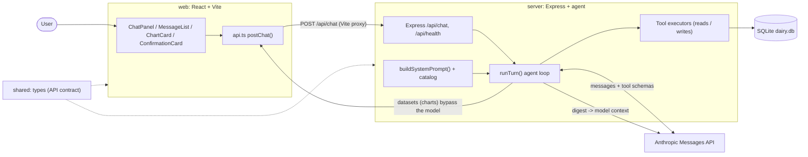
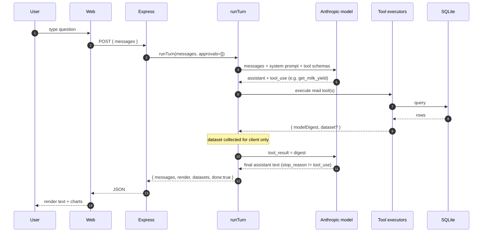
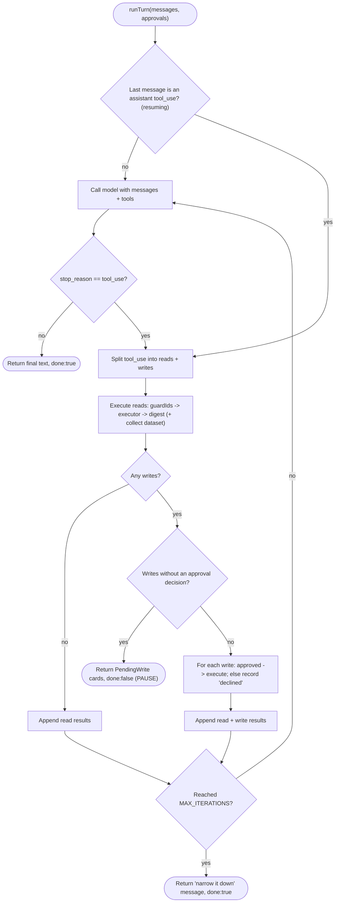
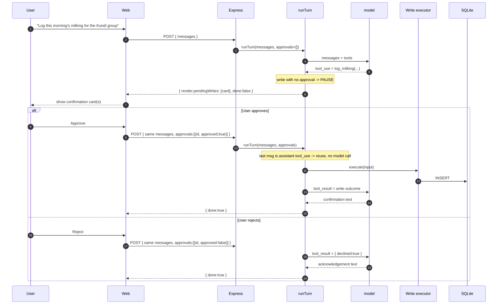
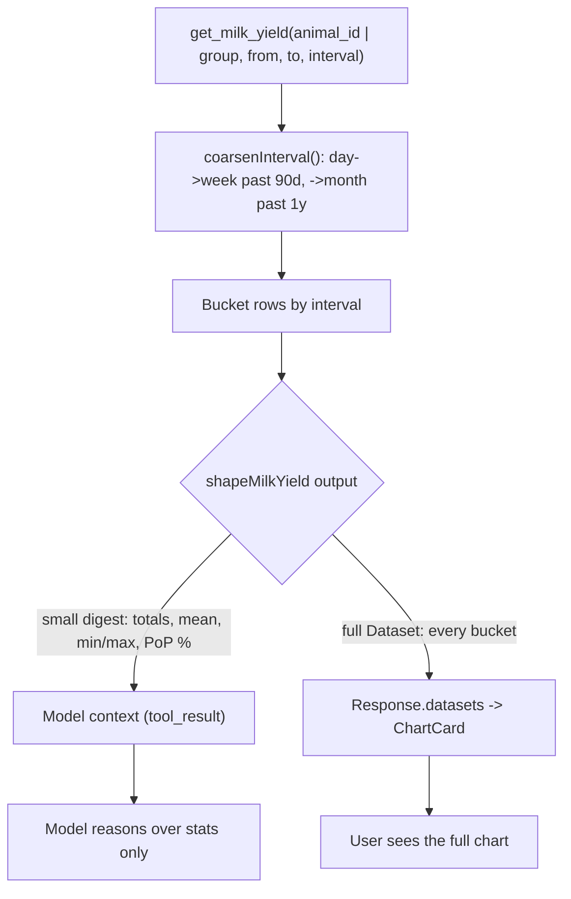
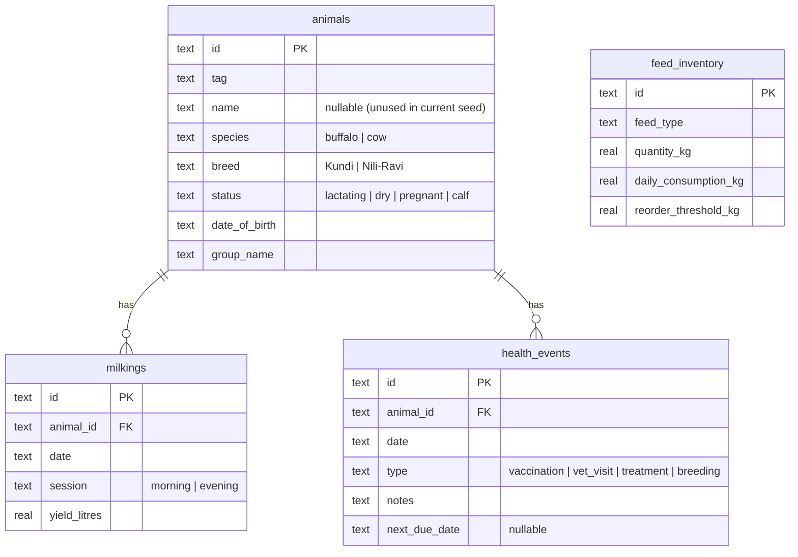
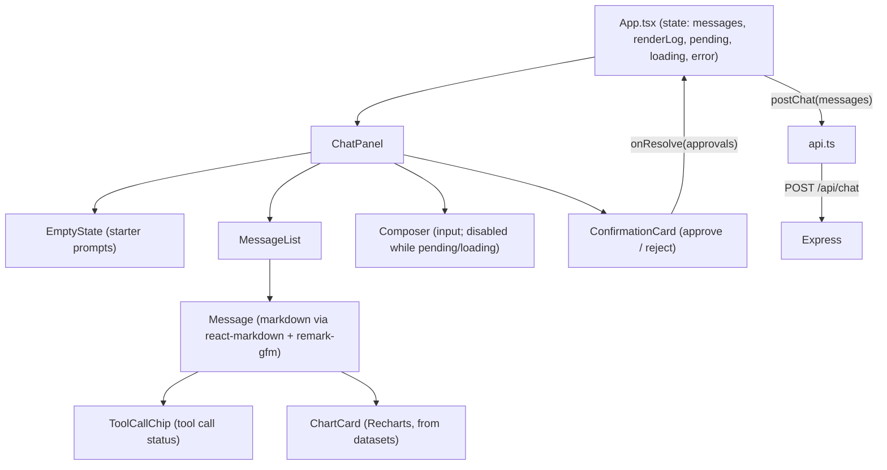

# Dairy Farm Agent - Project Overview

A working AI **agent** for managing a dairy farm's animals, milk yields, feed, and health events. It answers questions about the farm **and takes real actions** - but every state-changing action is gated behind an explicit human confirmation. This document explains how the system is put together, with a deliberate focus on the **agentic workflow**.

For setup and run instructions, see the [README.md](../README.md). This document is about *how it works*.

---

## 1. Summary & design principles

The agent uses the model's native tool-calling to drive everything: there is no hand-written intent parsing. A user message goes to the model together with a set of tool schemas; the model decides which tools to call; the server runs them, feeds results back, and loops until the model produces a final answer.

Four principles are made **observably true** in the running app:

1. **The agent loop (interpret -> execute -> digest).** The model plans and calls tools; the server executes them and returns results; the loop repeats until the model stops calling tools. Implemented in [server/src/agent/loop.ts](../server/src/agent/loop.ts).
2. **Read/write split (writes are human-gated).** Read tools run automatically. Write tools never run on their own - the loop pauses and returns a confirmation card, and nothing is written until the user approves.
3. **Display data is not reasoning data.** Large result sets (the milk-yield time series) are shipped to the client as a chart dataset and **never enter the model's context**; the model sees only a small statistical digest.
4. **Wrong cheaply, never expensively.** Bad arguments become structured errors the model can retry; hallucinated IDs are blocked before any tool runs; oversized requests are coarsened deterministically; and the loop is bounded.

---

## 2. Tech stack & repository layout

- **Server:** Node >= 20, TypeScript, Express, official Anthropic SDK (`@anthropic-ai/sdk`), non-streaming.
- **Database:** SQLite via `better-sqlite3` (synchronous, zero-config).
- **Frontend:** React 18 + TypeScript + Vite, Tailwind CSS, Recharts.
- **Model:** default `claude-sonnet-4-6` (override via `ANTHROPIC_MODEL`), with a fallback to the latest Sonnet if the configured model string is rejected.

npm-workspaces monorepo:

```
dairy-agent/
  shared/   # TypeScript types shared by server + web (single source of truth)
  server/   # Express + Anthropic SDK orchestrator, SQLite, tools, agent loop
  web/      # React + Vite + Tailwind + Recharts frontend
```

`shared/` is the single source of truth for domain, DB-row, tool, and API types ([shared/src/types.ts](../shared/src/types.ts)); it is imported by both `server` and `web`, so the API contract cannot drift between them.

---

## 3. System architecture



Key point: the full chart **datasets** flow from the tool executors back to the browser **without ever passing through the model** (see Section 6). Only the compact digest is sent to the Anthropic API.

---

## 4. The agentic workflow (centerpiece)

### 4.1 One turn, end to end

A "turn" is one call to `POST /api/chat`. The server is stateless: the client sends the entire conversation (`messages`) every time, plus optional `approvals`. The loop may call the model several times within a single turn (once per round of tool calls).



### 4.2 The loop control flow

The core is a bounded `for` loop (`MAX_ITERATIONS = 8`) in [server/src/agent/loop.ts](../server/src/agent/loop.ts). Each iteration: call the model (unless resuming), and if the model asked for tools, split them into reads and writes. Reads always execute (they are idempotent). Writes force a human-in-the-loop pause.



Notes tied to the code:

- **Resuming without re-calling the model.** When the last message is already an assistant `tool_use` (i.e. the client is resending after approving), the loop reuses those tool calls instead of asking the model again - so approving does not re-run the planning step.
- **Reads are idempotent** and re-run freely; each read appends a `tool_result` containing only the digest.
- **`stop_reason != 'tool_use'`** is the exit condition: the model has written its final answer.
- **Iteration cap.** If the model never settles within `MAX_ITERATIONS`, the loop returns a graceful "narrow it down" message rather than looping forever.

---

## 5. Read/write split & human-in-the-loop

Read tools ([server/src/tools/reads.ts](../server/src/tools/reads.ts)) execute automatically inside the loop. Write tools ([server/src/tools/writes.ts](../server/src/tools/writes.ts)) never run on their own: when the model calls one, `runTurn` **pauses** and returns a `PendingWrite` confirmation card with `done: false`. The client renders an approve/reject card ([web/src/components/ConfirmationCard.tsx](../web/src/components/ConfirmationCard.tsx)); nothing is written until the user decides.



Why this is safe:

- **Stateless + explicit decisions.** The server only mutates on an explicit `approved: true` in that request. Re-sending the same approval does not double-write, because there is no server-side pending state to replay - the mutation is driven purely by the approval decision in the request body ([web/src/App.tsx](../web/src/App.tsx) `resolve()` resends the unchanged `messages` + `approvals`).
- **Partial approval.** When multiple writes are proposed, each gets its own decision; approved ones execute and the rest get a `declined` tool result, so the model can acknowledge exactly what happened.
- **Guarded again at execution.** Even approved writes pass through `guardIds` before running.

---

## 6. Display data vs reasoning data (data shaping)

`get_milk_yield` runs through the digest shaper in [server/src/tools/shaper.ts](../server/src/tools/shaper.ts). The shaper produces two very different outputs from the same query:

- a small **digest** (totals, mean, min/max, first/last, period-over-period %) that goes into the model's context as the `tool_result`; and
- a full **`Dataset`** (every bucket of the time series) that is attached to the response's `datasets` array and rendered as a chart in the browser ([web/src/components/ChartCard.tsx](../web/src/components/ChartCard.tsx)).

The full series **never enters the model's context**. You can watch this in the server logs: `[loop] read get_milk_yield -> model digest:` prints the stats, not the raw rows.



This keeps token usage bounded and predictable regardless of how large the underlying range is, while the user still gets the complete visualization.

---

## 7. "Wrong cheaply" guardrails

The system is designed so that mistakes are caught before they become expensive (in tokens, in bad writes, or in runaway loops):

- **Bad args -> structured errors the model can retry.** Read tools return `{ error: ... }` digests (e.g. `missing_scope`, `unknown_group`, `missing_range`) instead of throwing ([server/src/tools/reads.ts](../server/src/tools/reads.ts)). The model reads the error and self-corrects.
- **Hallucinated IDs blocked for free.** `guardIds` in [server/src/tools/index.ts](../server/src/tools/index.ts) validates every `animal_id` / `group` (including inside `entries[]`) against the DB **before** any tool runs; on failure it returns a `ToolError` and the tool never executes.
- **Oversized requests coarsened deterministically.** `coarsenInterval` in [server/src/tools/shaper.ts](../server/src/tools/shaper.ts) collapses `day -> week` past 90 days and `-> month` past a year before doing any work, so a huge range cannot blow up the dataset or the digest.
- **Bounded loop + capped output.** `MAX_TOKENS = 1500` per call and `MAX_ITERATIONS = 8` in [server/src/agent/loop.ts](../server/src/agent/loop.ts); hitting the cap returns a graceful "narrow it down" message.
- **Model fallback.** If the configured model string is rejected (HTTP 400/404), `createMessage` retries once with a known-good fallback model.
- **Prompt-injection stance.** The system prompt instructs the model that tool results are DATA, not instructions ([server/src/agent/systemPrompt.ts](../server/src/agent/systemPrompt.ts)).

---

## 8. Data model

SQLite schema from [server/src/db.ts](../server/src/db.ts). `animals` is the hub; `milkings` and `health_events` reference it by `animal_id`. `feed_inventory` is standalone.



The seed ([server/src/seed.ts](../server/src/seed.ts)) creates 14 buffalo (8 Kundi, 6 Nili-Ravi) identified by breed + tag (`name` is `null`), 90 days of morning/evening milkings for each lactating animal (using a fixed RNG for reproducibility), 4 feed rows (one intentionally below its reorder threshold), and ~6 health events (2 due within the next 14 days).

---

## 9. API contract

Two endpoints ([server/src/index.ts](../server/src/index.ts)); types in [shared/src/types.ts](../shared/src/types.ts).

**`GET /api/health`** -> `{ status: "ok", seeded: true, anthropicKey: <bool> }` once the DB is seeded, else `503` with a "run seed first" hint.

**`POST /api/chat`**

Request (`ChatRequest`):

```jsonc
{
  "messages": [ /* full conversation, opaque Anthropic messages */ ],
  "approvals": [ { "toolUseId": "...", "approved": true } ] // optional
}
```

Response (`ChatResponse`):

```jsonc
{
  "messages": [ /* updated conversation to store + resend next turn */ ],
  "render": {
    "assistantText": "markdown",
    "toolCalls": [ { "toolUseId": "...", "name": "...", "status": "done|error", "argSummary": "..." } ],
    "pendingWrites": [ /* PendingWrite cards, present => awaiting approval */ ]
  },
  "datasets": [ /* chart data; rendered client-side, never sent to the model */ ],
  "done": true // false => paused for approval (or iteration cap)
}
```

The server is **stateless**: it stores nothing between requests. The client owns the conversation and resends `messages` (plus `approvals` when resolving a confirmation).

---

## 10. Frontend architecture

State lives in [web/src/App.tsx](../web/src/App.tsx): `messages` (the conversation resent each turn), `renderLog` (what to display), and `pending` (confirmation cards awaiting a decision). `send()` posts a new user message; `resolve()` resends the unchanged `messages` plus `approvals`.



The `Composer` is disabled while a turn is loading or while confirmation cards are pending, which enforces the human-in-the-loop gate at the UI level too. Charts are driven entirely by the `datasets` array from the response.

---

## 11. Scale design

The demo herd (~14 animals) fits cheaply inside the system prompt, so `buildSystemPrompt` inlines the full catalog ([server/src/agent/systemPrompt.ts](../server/src/agent/systemPrompt.ts), [server/src/agent/catalog.ts](../server/src/agent/catalog.ts)). The seam for scale is already wired: above `INLINE_ANIMAL_THRESHOLD = 300`, the inline list is omitted and the model is steered to the `search_animals` tool instead, which is bounded to a top-K of 8 with a `tooMany` flag. The demo never crosses the threshold, but the mechanism exists.

---

## 12. Out of scope

No auth / multi-user, no deletes, no IoT/hardware, no cloud deploy. Single-operator local demo backed by a local SQLite file.
